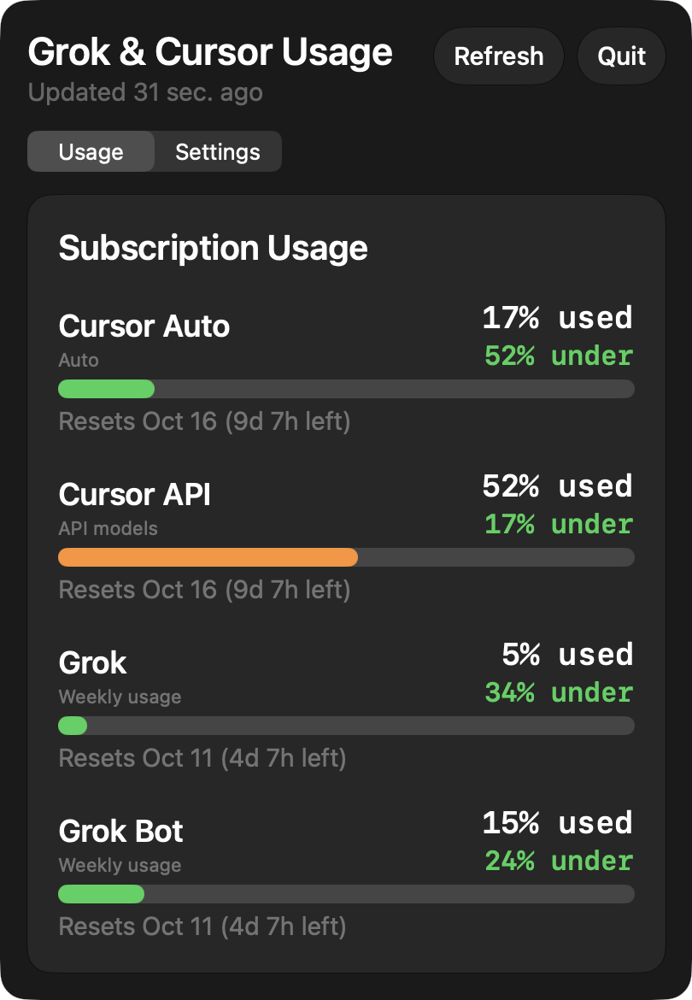

# Grok & Cursor Usage

A macOS menu bar app that shows how much of your Cursor and Grok plan you have used. A small read-only iPhone viewer is included.



- **Menu bar at a glance.** Shows the pool you used most recently and its percent, such as `CUR` / `11%`. It switches when a different pool moves.
- **Every pool in one menu.** Cursor Auto, Cursor API, Grok, and Grok Bot. When a service reports your plan name, such as Cursor Pro or SuperGrok, that becomes the title. Pools your account does not have are left off.
- **Pace.** Each bar says whether you are over, under, or on pace for its billing period, and when it resets.
- **Spike Alerts.** An optional notification when a pool climbs 15 points in one day.
- **Settings.** Text size from 75% to 125%, System, Light, or Dark appearance, and Open at Login.
- **No account of its own.** It uses the Cursor and Grok sign-ins already on your Mac.

There is no downloadable build. Clone this repo and run it from Xcode.

## Requirements

- macOS 14 or later
- [Xcode](https://apps.apple.com/app/xcode/id497799835) from the Mac App Store
- An Apple ID added in Xcode (**Xcode → Settings → Accounts**)
- Cursor, the grok CLI, or Grok.app signed in on the same Mac

A free Apple ID can run the menu bar app on your own Mac. The iPhone app needs a paid [Apple Developer Program](https://developer.apple.com/programs/) membership, because it uses iCloud.

## Build and run

1. Clone the repo and open `GrokCursorUsage.xcodeproj`.

   ```bash
   git clone https://github.com/KevinLogan84/grok-cursor-usage.git
   cd grok-cursor-usage
   open GrokCursorUsage.xcodeproj
   ```

2. Select the **GrokCursorUsage** scheme.
3. Select the **GrokCursorUsage** target, then **Signing & Capabilities**.
4. Set **Team** to your Apple ID. The project is checked in with the author’s team (`KVVL57G45T`), which is not on your Mac.
5. If Xcode says the bundle ID `com.grokcursorusage.app` is unavailable, change it to one your team owns, such as `com.yourname.grokcursorusage`.
6. Press ⌘R.
7. Look in the menu bar for a two-line item such as `CUR` / `11%`. There is no Dock icon. Click it to open the menu.

### Free Apple ID (Personal Team)

A Personal Team cannot sign iCloud, and the container in this repo belongs to the author. For the menu bar app alone, remove these three keys from `GrokCursorUsage/GrokCursorUsage.entitlements`:

- `com.apple.developer.icloud-container-identifiers`
- `com.apple.developer.icloud-services`
- `com.apple.developer.ubiquity-kvstore-identifier`

Everything on the Mac still works. Skip the iPhone target.

### Keep it running

To keep the app after you close Xcode, choose **Product → Show Build Folder in Finder**, copy `Build/Products/Debug/Grok & Cursor Usage.app` into `/Applications`, and open that copy. Then turn on **Open at Login** in the menu’s **Settings** tab. Login items need the copy in `/Applications`.

## Sign-ins it uses

| Pool | Shows up when |
| --- | --- |
| Cursor Auto and Cursor API | Cursor is signed in on this Mac. |
| Grok | The grok CLI (`~/.grok/auth.json`) or Grok.app is signed in. |
| Grok Bot | Cursor reports a Grok Bot allowance for your account. |

Cursor’s token is read from `~/Library/Application Support/Cursor/User/globalStorage/state.vscdb`. The `GROK_HOME` and `GROK_AUTH_JSON` environment variables are honored, but an app opened from Finder does not see variables set in your shell profile. To use them, add them under **Product → Scheme → Edit Scheme → Run → Arguments → Environment Variables**. They apply only when Xcode launches the app.

## Using it

- Usage reloads at launch, every minute, and when you click **Refresh**.
- The **Usage** tab lists every pool with its reset date. If a pool cannot be read, its row says what to do next.
- Pace compares percent used with how much of that pool’s period has passed.
- **Spike Alerts** posts at most once per pool per day, when that pool climbs 15 points from its first reading that day. The day follows your Mac’s time zone. macOS asks for notification permission when you turn it on. If you declined, the **Settings** tab shows **Open Notification Settings**.
- The **Settings** tab holds Text Size, Appearance, Open at Login, Spike Alerts, and the in-app **Guide**.
- **Quit** is in the menu header.

## Troubleshooting

**Grok says to sign in, but Grok.app is signed in.** Open **System Settings → Privacy & Security → Full Disk Access** and turn on **Grok & Cursor Usage**. Grok.app keeps its grok.com session in a cookie file that other apps cannot read without that permission. Or run `grok login` in Terminal.

**Cursor says to open Cursor.** Open Cursor once and stay signed in, then click **Refresh**.

**A bar went blank after it used to work.** Cursor and xAI do not publish these usage endpoints, so a change on their side can break a bar. Pull the latest code, or [open an issue](https://github.com/KevinLogan84/grok-cursor-usage/issues).

**Xcode signing errors.** Make sure **Team** is set on the target you are building and the bundle ID is one your team owns. On a free Apple ID, remove the iCloud keys listed above.

## Privacy

The project runs no server and includes no analytics or tracking.

- **What it reads:** Cursor’s local database (`state.vscdb`), the grok CLI’s `auth.json`, and, with Full Disk Access, Grok.app’s cookie file. It does not change any of them.
- **Where it connects:** Cursor (`api2.cursor.sh`) and xAI (`grok.com`, `auth.x.ai`), using those sign-ins to request your usage.
- **What it stores:** Settings and alert state in the app’s preferences. If iCloud is enabled, the latest usage numbers go to your own iCloud key-value store for the iPhone viewer. Sign-in tokens are never written to iCloud.

## iPhone viewer (optional)

The **GrokCursorUsageIOS** target is read-only. It never signs in to Cursor or Grok. It shows the last snapshot the Mac app wrote to your iCloud.

Building it takes a paid Apple Developer Program membership, your own bundle IDs, and your own iCloud container.

1. Sign the Mac and the iPhone into the same Apple ID.
2. In [Certificates, Identifiers & Profiles](https://developer.apple.com/account/resources), create an iCloud container you own, such as `iCloud.com.yourname.grokcursorusage`.
3. Replace `iCloud.com.grokcursorusage` with that container in all three of these files:
   - `GrokCursorUsage/GrokCursorUsage.entitlements`
   - `GrokCursorUsageIOS/GrokCursorUsageIOS.entitlements`
   - `Shared/QuotaSnapshot.swift` (`QuotaSnapshotCodec.iCloudContainerID`)
4. Leave the key-value store identifier as `$(TeamIdentifierPrefix)com.grokcursorusage` in both entitlements files, so the Mac and the iPhone share one store under your team.
5. If a bundle ID is unavailable, change `com.grokcursorusage.app` and `com.grokcursorusage.ios` to IDs your team owns. Use the same team on both targets.
6. On each App ID, enable **iCloud** with Key-value storage and the container from step 2.
7. Select the **GrokCursorUsageIOS** scheme, choose your iPhone, and press ⌘R. The iPhone target requires iOS 26.
8. Run the Mac app once so it publishes, then open the iPhone app. **Refresh** asks iCloud for a newer snapshot.

## Tests

In Xcode, with the **GrokCursorUsage** scheme selected, press ⌘U. From Terminal:

```bash
xcodebuild test -project GrokCursorUsage.xcodeproj -scheme GrokCursorUsage -destination 'platform=macOS' \
  -only-testing:GrokCursorUsageTests CODE_SIGNING_ALLOWED=NO
```

## Contributing

Issues and pull requests are welcome. Please run the tests before opening a pull request. Leave your own team, bundle ID, and iCloud container changes out of it, and never commit tokens or cookies.

## License

[MIT](LICENSE). Copyright (c) 2026 Kevin Logan.

Not affiliated with, endorsed by, or sponsored by Anysphere (Cursor) or xAI (Grok). Cursor and Grok are trademarks of their owners.
